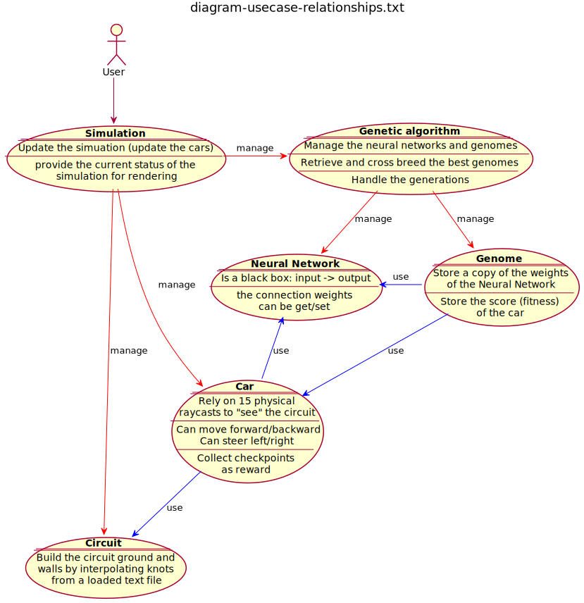

# Table of Contents
- [Table of Contents](#table-of-contents)
- [Emscripten Version](#emscripten-version)
  - [Online live demo 3D](#online-live-demo-3d)
  - [Diagrams](#diagrams)
  - [How to Build](#how-to-build)
    - [Build native C++ pthread](#build-native-c-pthread)
    - [Build emscripten C++ pthread (for Chrome on desktop only)](#build-emscripten-c-pthread-for-chrome-on-desktop-only)
    - [Build emscripten C++ webworker (mobile & firefox friendly)](#build-emscripten-c-webworker-mobile--firefox-friendly)
  - [Thanks for watching !](#thanks-for-watching-)

# Emscripten Version

## Online live demo 3D

http://guillaumebouchetepitech.github.io/geneticAlgorithm_experiment/emscripten/bullet/dist/index.html

## Diagrams





## How to Build

### Build native C++ pthread

```bash
# the first two steps can be slow (especially on modest internet connection)
sh sh_install_thirdparties.sh

sh sh_build.sh # build bullet library first
# this script is interactive:
# -> select "bullet"
# -> then platform "native"
# -> then mode "release"
# -> then rebuild "yes"

sh sh_build.sh # build the linux binary
# this script is interactive:
# -> select "experiment"
# -> then platform "native"
# -> then mode "release"
# -> then rebuild "yes"
```

then run `./bin/exec`

### Build emscripten C++ pthread (for Chrome on desktop only)

```bash
# the first two steps can be slow (especially on modest internet connection)
sh sh_install_thirdparties.sh
sh sh_install_tools.sh

sh sh_build.sh # build bullet library first
# this script is interactive:
# -> select "bullet"
# -> then platform "web pthread"
# -> then mode "release"
# -> then rebuild "yes"

sh sh_build.sh # build the wasm binary
# this script is interactive:
# -> select "experiment"
# -> then platform "web pthread"
# -> then mode "release"
# -> then rebuild "yes"

node dumbFileServer.js # launch the file server
```

then use **chrome browser on a desktop** to load `http://127.0.0.1:9000/dist/index.html`

### Build emscripten C++ webworker (mobile & firefox friendly)

```bash
# the first two steps can be slow (especially on modest internet connection)
sh sh_install_thirdparties.sh
sh sh_install_tools.sh

sh sh_build.sh # build bullet library first
# this script is interactive:
# -> select "bullet"
# -> then platform "web worker"
# -> then mode "release"
# -> then rebuild "yes"

sh sh_build.sh # build the wasm binary
# this script is interactive:
# -> select "experiment"
# -> then platform "web worker"
# -> then mode "release"
# -> then rebuild "yes"

node dumbFileServer.js # launch the file server
```

then use **firefox browser** to load `http://127.0.0.1:9000/dist/index.html`

## Thanks for watching !
