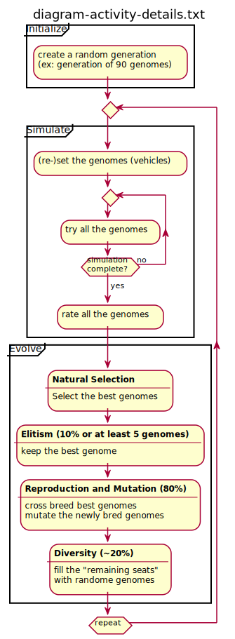

# Table of Contents
- [Table of Contents](#table-of-contents)
- [Emscripten Version](#emscripten-version)
  - [Online live demo 3D](#online-live-demo-3d)
  - [Diagrams](#diagrams)
- [How to Build](#how-to-build)
  - [Build native C++](#build-native-c)
  - [Build emscripten C++](#build-emscripten-c)
    - [with multithreading support (desktop friendly)](#with-multithreading-support-desktop-friendly)
    - [without multithreading support: webworkers (mobile friendly)](#without-multithreading-support-webworkers-mobile-friendly)
- [Thanks for watching!](#thanks-for-watching)

# Emscripten Version

## Online live demo 3D

http://guillaumebouchetepitech.github.io/geneticAlgorithm_experiment/emscripten/bullet/dist/index.html

## Diagrams




# How to Build

## Build native C++

```bash
# the first step require the shared-framework libraries to be built
# -> check: ../shared-framework/README.md

sh sh_build.sh
# this script is interactive:
# -> select platform
#   -> "native"
# -> then mode
#   -> "release"
# -> then rebuild
#   -> "yes"
```

then run `./bin/exec`

## Build emscripten C++

### with multithreading support (desktop friendly)

```bash
# the first step require the shared-framework libraries to be built
# -> check: ../shared-framework/README.md

sh sh_build.sh
# this script is interactive:
# -> select platform
#   -> "web (pthread)"
# -> then mode
#   -> "release"
# -> then rebuild
#   -> "yes"

node dumbFileServer.js # launch the file server
```

then use **firefox/chrome browser (desktop adviseable)** to load `http://127.0.0.1:9001/dist/index.html`

### without multithreading support: webworkers (mobile friendly)

```bash
# the first step require the shared-framework libraries to be built
# -> check: ../shared-framework/README.md

sh sh_build.sh
# this script is interactive:
# -> select platform
#   -> "web (worker)"
# -> then mode
#   -> "release"
# -> then rebuild
#   -> "yes"

node dumbFileServer.js # launch the file server
```

then use **firefox/chrome browser (should support desktop and mobile)** to load `http://127.0.0.1:9000/dist/index.html`

# Thanks for watching!
